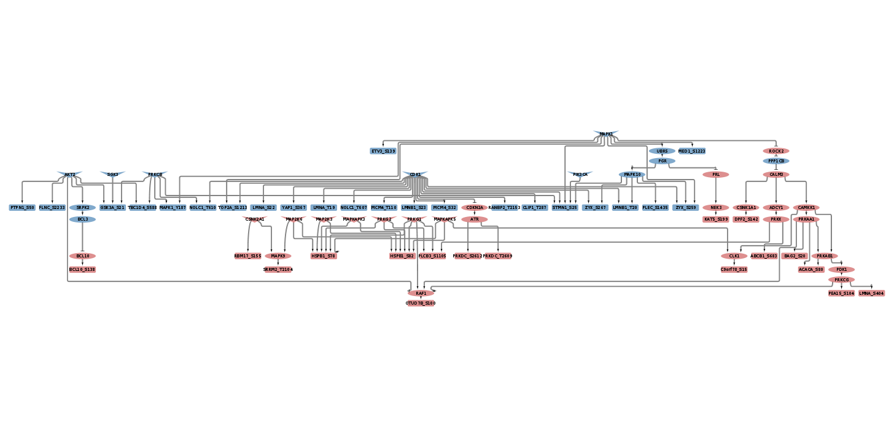
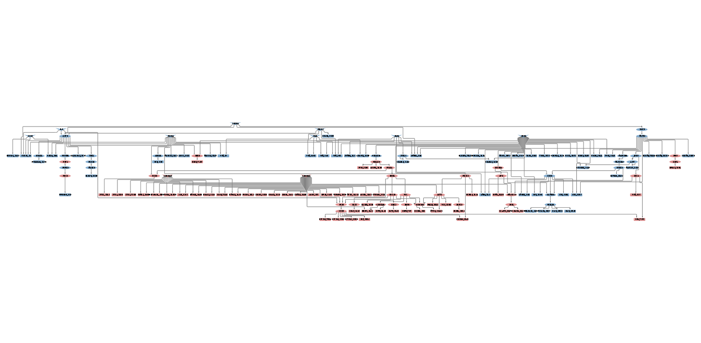
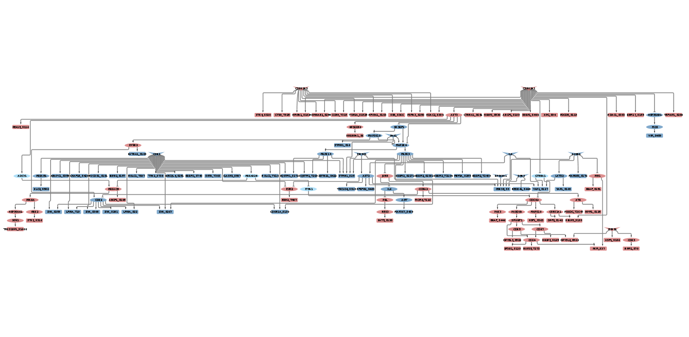
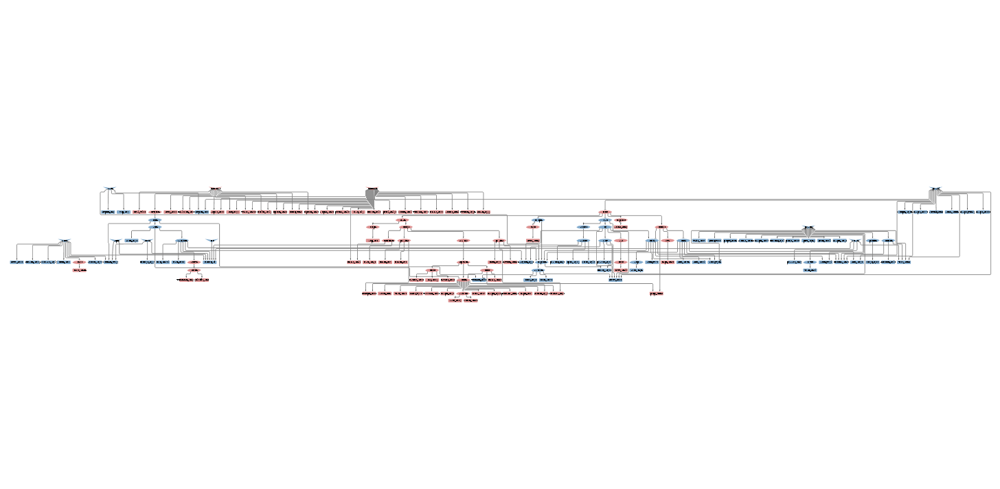
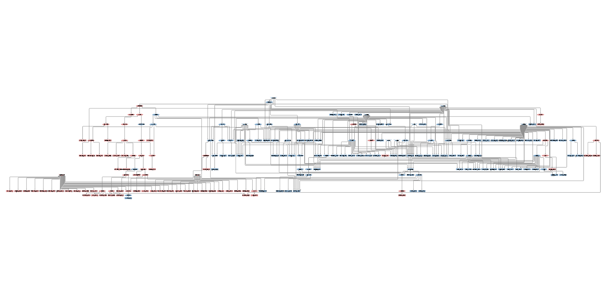
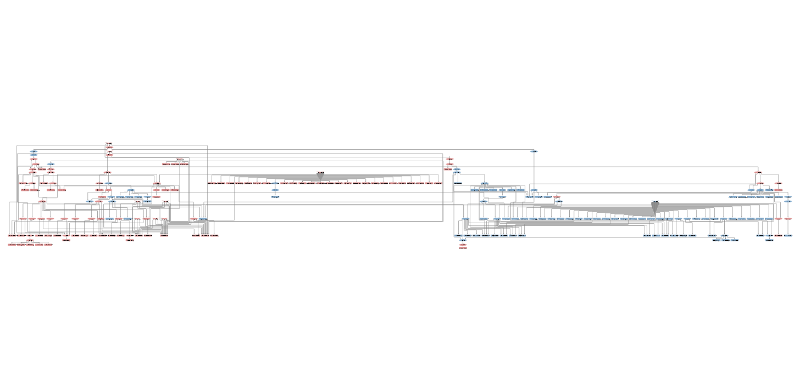

```{r setup, include=FALSE}
knitr::opts_chunk$set(echo = TRUE)
```

### License Info

This program is free software: you can redistribute it and/or modify it under 
the terms of the GNU General Public License as published by the Free Software 
Foundation, either version 3 of the License, or (at your option) any later 
version.

This program is distributed in the hope that it will be useful, but WITHOUT ANY 
WARRANTY; without even the implied warranty of MERCHANTABILITY or FITNESS FOR 
A PARTICULAR PURPOSE. See the GNU General Public License for more details.

Please check http://www.gnu.org/licenses/.

## Introduction

The present script takes phosphoproteomics data at different times after 
SARS-CoV-2 infection of VERO E6 cells to run CARNIPHAL, a version of 
CARNIVAL adapted to phosphoproteomics. CARNIPHAL takes as input the
differentially expressed phosphosites and the kinase activities in a given 
condition along with a prior knowledge network containing both protein-protein 
interactions and enzyme substrate reactions. Thanks to this information, 
CARNIPHAL infers causal networks connecting the downstream deregulated 
phosphosites with their most likely upstream kinase activities. 

## Getting the inputs for CARNIPHAL  

We first load the required libraries and define a function to export CARNIVAL
results to cytoscape.

```{r, message=FALSE, warning=FALSE}
library(readr)
library(CARNIVAL)
library(OmnipathR)
library(dplyr)
library(readr)
library(tidyr)
library(ggplot2)
library(VennDiagram)

## We also define a function to format the CARNIVAL output to cytoscape
OutputCyto <- function(CarnivalResults, outputFile) {
    CarnivalNetwork <- 
        as.data.frame(CarnivalResults$weightedSIF, stringsAsFactors = FALSE) 
    
    CarnivalNetworkNodes <- 
        unique(c(CarnivalNetwork$Node1,CarnivalNetwork$Node2))
    
    CarnivalAttributes <- CarnivalResults$nodesAttributes %>% 
        as.data.frame() %>%
        dplyr::filter(Node %in% CarnivalNetworkNodes) %>%
        dplyr::mutate(NodeType = as.character(NodeType)) %>%
        dplyr::mutate(NodeType=if_else(NodeType =="", "I", NodeType))
            
    nameOutputNetwork <- paste0(outputFile, "Network.sif")
    nameOutputAttributes <-  paste0(outputFile, "Attributes.txt")    
    
    write.table(CarnivalNetwork[,c(1,2,3)], file = nameOutputNetwork,
        quote = FALSE, row.names = FALSE, col.names = FALSE, sep = " ")
    
    write.table(CarnivalAttributes, file = nameOutputAttributes,
        quote = FALSE, row.names = FALSE, col.names = TRUE, sep = "\t")
}
```

### Generating the Prior Knowledge Network from Omnipath

We use the OmnipathR package to fetch the Omnipath database and generate the 
prior knowledge network. We first take the protein-protein interactions. We 
just considered signed and directed interactions. 

```{r}
ia_omnipath <- import_omnipath_interactions() %>% as_tibble()
ia_pwextra <- import_pathwayextra_interactions() %>% as_tibble()
ia_kinaseextra <- import_kinaseextra_interactions() %>% as_tibble()

## We bind the datasets
interactions <- as_tibble(
    bind_rows(
        ia_omnipath %>% mutate(type = 'ppi'),
        ia_pwextra %>% mutate(type = 'ppi'),
        ia_kinaseextra %>% mutate(type = 'ppi')))

signed_directed_interactions <- 
    dplyr::filter(interactions, consensus_direction==1) %>%
    filter(consensus_stimulation == 1 | consensus_inhibition == 1) %>% 
    dplyr::mutate(sign = if_else(consensus_stimulation==1,1,-1))  %>%
    dplyr::select(source_genesymbol, sign,  target_genesymbol) %>%
    dplyr::rename(source ="source_genesymbol", target ="target_genesymbol")
```

And then enzyme-substate reactions that are characterized as phospho or 
dephosphorylation

```{r}
enzyme_substrate <- import_omnipath_enzsub() %>% 
    as_tibble() %>% 
    dplyr::filter(modification %in% c("phosphorylation","dephosphorylation")) %>% 
    dplyr::mutate(substrate = 
        paste0(.$substrate_genesymbol,"_",.$residue_type,.$residue_offset)) %>% 
    dplyr::mutate(sign = ifelse(.$modification == "phosphorylation",1,-1)) %>%
    dplyr::select(enzyme_genesymbol, sign, substrate) %>%
    dplyr::rename(source ="enzyme_genesymbol", target ="substrate") 

all_phosphosites_omnipath <- enzyme_substrate %>%
    dplyr::pull(target) %>% unique()
```

We merge these two types of interactions to create our prior knowledge network

```{r}
carnival_pkn <- 
    dplyr::bind_rows(signed_directed_interactions, enzyme_substrate) %>%
    dplyr::distinct(source, target, .keep_all = TRUE)

all_source_nodes <- unique(carnival_pkn$source)
```

### Reading the Phosphoproteomics data

We read the results from the differential expression analysis on the 
phosphoproteomics data and the kinase activity estimations. 

```{r, warning=FALSE, message=FALSE}
## Phospho differential expression results. 
phosphosites_dea <- 
    read_tsv("Krogan/2020_04_30.fullPH.2runsOut.censored.msstats_results.withFeatureRunData_FILTERED_FINAL.txt") 

all_phosphosites_data <- unique(phosphosites_dea$singleSite_human)

## Kinase Activity
kinase_activity <- 
    read_csv("Krogan/covidKinaseActMat.csv") %>% 
    mutate_all(~replace(., is.na(.), 0)) %>% 
    dplyr::rename(kinase = "X1")
```

We next check the overlap between the phosphosites presents in our prior 
knowledge network and the experimental data: 

```{r, dpi=300}
Venn_plot <- draw.pairwise.venn(length(all_phosphosites_data), 
    length(all_phosphosites_omnipath), 
    length(intersect(all_phosphosites_data,
    all_phosphosites_omnipath)), 
    category = c("Data Phosphosites", "Omnipath Phosphosites"), 
    lty = rep("blank", 2), fill = c("light blue", "red"), alpha = rep(0.4, 2), 
    cat.pos = c(0, 0), cat.dist = rep(0.025, 2), cex= 1.5, cat.cex=1.5, 
    verbose = FALSE)
grid.draw(Venn_plot)
```

To run CARNIPHAL, we have to decide which phosphosites and kinase activities
we are going to use as input for every condition. For the phosphosites, we 
select the differentially expressed (adjusted pvalue < 0.05 and abs(logFC) > 1). 
For the kinase activties is no so straigthforward. Since we have the activity of 
about 100 kinases, we decided to select the top 10 in absolute value.  

```{r, dpi=300}
## Kinase Activity. How many kinases to use? 
cut_off_kinases <- 10

kinase_activity_longer <- 
    pivot_longer(kinase_activity, -kinase, names_to = "condition", 
    values_to = "activity")

kinase_cutoff <- kinase_activity_longer %>% 
    dplyr::group_by(condition) %>% 
    dplyr::top_n(cut_off_kinases, wt = abs(activity))

upper_cutoff <- kinase_cutoff %>% 
    dplyr::filter(activity > 0) %>% 
    dplyr::pull(activity) %>% min()

lower_cutoff <-  - (kinase_cutoff %>% 
    dplyr::filter(activity < 0) %>% 
    dplyr::pull(activity) %>% abs %>% min() )
    
ggplot(kinase_activity_longer, aes(x=condition, y=activity, fill=condition)) + 
  geom_boxplot() + theme_light() + 
    theme(axis.text.x = element_text(size = 7, angle = 90))

ggplot(kinase_activity_longer, aes(x=activity, fill=condition)) + 
  geom_density(alpha=0.2) + theme_light() 
```

## Results

We here present the CARNIPHAL results after SARS-CoV-2 infection at different 
time points versus mock treated controls at time 00Hr.

### Time Point 00Hr 

The phospo data was generated just after the infection of the VERO E6 cells. 

We select the phosphosites and kinases for the input. 

```{r}
deregulated_phosphosites_00Hr <- phosphosites_dea %>% 
    dplyr::filter(Label == "Inf_00Hr-Ctrl_00Hr") %>% 
    dplyr::filter(adj.pvalue < 0.05, abs(log2FC) > 1) %>%  
    dplyr::select(Tvalue, singleSite_human) %>%
    dplyr::filter(singleSite_human %in% all_phosphosites_omnipath) %>%
    tibble::column_to_rownames(var = "singleSite_human") %>%
    dplyr::filter(!is.na(Tvalue)) %>%  ### Ask about these NAs. 
    t() %>% 
    as.data.frame() 
length(deregulated_phosphosites_00Hr)   
 
kinase_activity_00Hr <- kinase_cutoff %>% 
    dplyr::filter(condition == "Inf_00Hr-Ctrl_00Hr_Log2FC") %>% 
    tibble::column_to_rownames(var = "kinase") %>%
    dplyr::select(activity) %>% 
    t() %>% 
    sign() %>%
    as.data.frame()
```

and We run CARNIVAL

```{r, message=FALSE, warning=FALSE, eval=FALSE}
CarnivalResults_00Hr <-runCARNIVAL(
    solverPath="/opt/ibm/ILOG/CPLEX_Studio129/cplex/bin/x86-64_linux/cplex",
    netObj=carnival_pkn,
    measObj=deregulated_phosphosites_00Hr,
    inputObj = kinase_activity_00Hr,
    # dir_name="Carnival_Results",
    # weightObj=as.data.frame(t(Kin_activity_LNCaP_noInhib_t1_EGF)),
    # nodeID = 'gene',
    timelimit = 1200,
    solver = "cplex")
saveRDS(CarnivalResults_00Hr, 
    file = "Carnival_Results/CarnivalResults_00Hr.rds")
OutputCyto(CarnivalResults_00Hr, 
    outputFile="Carnival_Results/CarnivalResults_00Hr")
```

Network with the results: Rectangles are the de-regulated phosphosites after
infection and the inverse triangles are the most active kinases. Ellipses are
signaling intermediates proteins or other enzymes activating hihgly deregulated
phosphosites. Red means positive activity or overphosphorylation after infection 
and blue the opposite. 


<br><br>

<br><br>


### Time Point 02Hr 

The phospo data was generated two hours after the infection of the VERO E6 
cells. 

We select the phosphosites and kinases for the input. 

```{r}
deregulated_phosphosites_02Hr <- phosphosites_dea %>% 
    dplyr::filter(Label == "Inf_02Hr-Ctrl_00Hr") %>% 
    dplyr::filter(adj.pvalue < 0.05, abs(log2FC) > 1) %>%  ## AS in the landscape phosphorilation paper. 
    dplyr::select(Tvalue, singleSite_human) %>%
    dplyr::filter(singleSite_human %in% all_phosphosites_omnipath) %>%
    tibble::column_to_rownames(var = "singleSite_human") %>%
    dplyr::filter(!is.na(Tvalue)) %>%  ### Ask about these NAs. 
    t() %>% 
    as.data.frame() 
length(deregulated_phosphosites_02Hr)    

kinase_activity_02Hr <- kinase_cutoff %>% 
    dplyr::filter(condition == "Inf_02Hr-Ctrl_00Hr_Log2FC") %>% 
    tibble::column_to_rownames(var = "kinase") %>%
    dplyr::select(activity) %>% 
    t() %>% 
    sign() %>%
    as.data.frame()
```

and we run CARNIVAL

```{r, message=FALSE, warning=FALSE, eval=FALSE}
CarnivalResults_02Hr <-runCARNIVAL(
    solverPath="/opt/ibm/ILOG/CPLEX_Studio129/cplex/bin/x86-64_linux/cplex",
    netObj=carnival_pkn,
    measObj=deregulated_phosphosites_02Hr,
    inputObj = kinase_activity_02Hr,
    # dir_name="Carnival_Results",
    # weightObj=as.data.frame(t(Kin_activity_LNCaP_noInhib_t1_EGF)),
    # nodeID = 'gene',
    timelimit = 1200,
    solver = "cplex")
saveRDS(CarnivalResults_02Hr, file = "Carnival_Results/CarnivalResults_02Hr.rds")
OutputCyto(CarnivalResults_02Hr, 
    outputFile="Carnival_Results/CarnivalResults_02Hr")
```

Network with the results: 
<br><br>

<br><br>

### Time Point 04Hr 

The phospo data was generated four hours after the infection of the VERO E6 
cells. 

We select the phosphosites and kinases for the input. 

```{r}
deregulated_phosphosites_04Hr <- phosphosites_dea %>% 
    dplyr::filter(Label == "Inf_04Hr-Ctrl_00Hr") %>% 
    dplyr::filter(adj.pvalue < 0.05, abs(log2FC) > 1) %>%  ## AS in the landscape phosphorilation paper. 
    dplyr::select(Tvalue, singleSite_human) %>%
    dplyr::filter(singleSite_human %in% all_phosphosites_omnipath) %>%
    tibble::column_to_rownames(var = "singleSite_human") %>%
    dplyr::filter(!is.na(Tvalue)) %>%  ### Ask about these NAs. 
    t() %>% 
    as.data.frame() 
length(deregulated_phosphosites_04Hr)    

kinase_activity_04Hr <- kinase_cutoff %>% 
    dplyr::filter(condition == "Inf_04Hr-Ctrl_00Hr_Log2FC") %>% 
    tibble::column_to_rownames(var = "kinase") %>%
    dplyr::select(activity) %>% 
    t() %>% 
    sign() %>%
    as.data.frame()
```

and we run CARNIVAL

```{r, message=FALSE, warning=FALSE, eval=FALSE}
CarnivalResults_04Hr <-runCARNIVAL(
    solverPath="/opt/ibm/ILOG/CPLEX_Studio129/cplex/bin/x86-64_linux/cplex",
    netObj=carnival_pkn,
    measObj=deregulated_phosphosites_04Hr,
    inputObj = kinase_activity_04Hr,
    # dir_name="Carnival_Results",
    # weightObj=as.data.frame(t(Kin_activity_LNCaP_noInhib_t1_EGF)),
    # nodeID = 'gene',
    timelimit = 3600,
    solver = "cplex")
saveRDS(CarnivalResults_04Hr, file = "Carnival_Results/CarnivalResults_04Hr.rds")
OutputCyto(CarnivalResults_04Hr, 
    outputFile="Carnival_Results/CarnivalResults_04Hr")
```

Network with the results: 
<br><br>

<br><br>


### Time Point 08Hr 

The phospo data was generated eight hours after the infection of the VERO E6 
cells. 

We select the phosphosites and kinases for the input. 

```{r}
deregulated_phosphosites_08Hr <- phosphosites_dea %>% 
    dplyr::filter(Label == "Inf_08Hr-Ctrl_00Hr") %>% 
    dplyr::filter(adj.pvalue < 0.05, abs(log2FC) > 1) %>%  ## AS in the landscape phosphorilation paper. 
    dplyr::select(Tvalue, singleSite_human) %>%
    dplyr::filter(singleSite_human %in% all_phosphosites_omnipath) %>%
    tibble::column_to_rownames(var = "singleSite_human") %>%
    dplyr::filter(!is.na(Tvalue)) %>%  ### Ask about these NAs. 
    t() %>% 
    as.data.frame() 
length(deregulated_phosphosites_08Hr)    

kinase_activity_08Hr <- kinase_cutoff %>% 
    dplyr::filter(condition == "Inf_08Hr-Ctrl_00Hr_Log2FC") %>% 
    tibble::column_to_rownames(var = "kinase") %>%
    dplyr::select(activity) %>% 
    t() %>% 
    sign() %>%
    as.data.frame()
```

and we run CARNIVAL

```{r, message=FALSE, warning=FALSE, eval=FALSE}
CarnivalResults_08Hr <-runCARNIVAL(
    solverPath="/opt/ibm/ILOG/CPLEX_Studio129/cplex/bin/x86-64_linux/cplex",
    netObj=carnival_pkn,
    measObj=deregulated_phosphosites_08Hr,
    inputObj = kinase_activity_08Hr,
    # dir_name="Carnival_Results",
    # weightObj=as.data.frame(t(Kin_activity_LNCaP_noInhib_t1_EGF)),
    # nodeID = 'gene',
    timelimit = 3600,
    solver = "cplex")
saveRDS(CarnivalResults_08Hr, file = "Carnival_Results/CarnivalResults_08Hr.rds")
OutputCyto(CarnivalResults_08Hr, 
    outputFile="Carnival_Results/CarnivalResults_08Hr")
```

Network with the results: 

<br><br>

<br><br>

### Time Point 12Hr 

The phospo data was generated twelve hours after the infection of the VERO E6 
cells. 

We select the phosphosites and kinases for the input. 

```{r}
deregulated_phosphosites_12Hr <- phosphosites_dea %>% 
    dplyr::filter(Label == "Inf_12Hr-Ctrl_00Hr") %>% 
    dplyr::filter(adj.pvalue < 0.05, abs(log2FC) > 1) %>%  ## AS in the landscape phosphorilation paper. 
    dplyr::select(Tvalue, singleSite_human) %>%
    dplyr::filter(singleSite_human %in% all_phosphosites_omnipath) %>%
    tibble::column_to_rownames(var = "singleSite_human") %>%
    dplyr::filter(!is.na(Tvalue)) %>%  ### Ask about these NAs. 
    t() %>% 
    as.data.frame() 
length(deregulated_phosphosites_12Hr)    

kinase_activity_12Hr <- kinase_cutoff %>% 
    dplyr::filter(condition == "Inf_12Hr-Ctrl_00Hr_Log2FC") %>% 
    tibble::column_to_rownames(var = "kinase") %>%
    dplyr::select(activity) %>% 
    t() %>% 
    sign() %>%
    as.data.frame()
```

and we run CARNIVAL

```{r, message=FALSE, warning=FALSE, eval=FALSE}
CarnivalResults_12Hr <-runCARNIVAL(
    solverPath="/opt/ibm/ILOG/CPLEX_Studio129/cplex/bin/x86-64_linux/cplex",
    netObj=carnival_pkn,
    measObj=deregulated_phosphosites_12Hr,
    inputObj = kinase_activity_12Hr,
    # dir_name="Carnival_Results",
    # weightObj=as.data.frame(t(Kin_activity_LNCaP_noInhib_t1_EGF)),
    # nodeID = 'gene',
    timelimit = 1200,
    solver = "cplex")
saveRDS(CarnivalResults_12Hr, file = "Carnival_Results/CarnivalResults_12Hr.rds")
OutputCyto(CarnivalResults_12Hr, 
    outputFile="Carnival_Results/CarnivalResults_12Hr")
```

Network with the results: 
<br><br>

<br><br>

### Time Point 24Hr 

The phospo data was generated 24 hours after the infection of the VERO E6 
cells. 

We select the phosphosites and kinases for the input. 

```{r}
deregulated_phosphosites_24Hr <- phosphosites_dea %>% 
    dplyr::filter(Label == "Inf_24Hr-Ctrl_00Hr") %>% 
    dplyr::filter(adj.pvalue < 0.05, abs(log2FC) > 1) %>%  ## AS in the landscape phosphorilation paper. 
    dplyr::select(Tvalue, singleSite_human) %>%
    dplyr::filter(singleSite_human %in% all_phosphosites_omnipath) %>%
    tibble::column_to_rownames(var = "singleSite_human") %>%
    dplyr::filter(!is.na(Tvalue)) %>%  ### Ask about these NAs. 
    t() %>% 
    as.data.frame() 
length(deregulated_phosphosites_24Hr)    

kinase_activity_24Hr <- kinase_cutoff %>% 
    dplyr::filter(condition == "Inf_24Hr-Ctrl_00Hr_Log2FC") %>% 
    tibble::column_to_rownames(var = "kinase") %>%
    dplyr::select(activity) %>% 
    t() %>% 
    sign() %>%
    as.data.frame()
```

and we run CARNIVAL

```{r, message=FALSE, warning=FALSE, eval=FALSE}
CarnivalResults_24Hr <-runCARNIVAL(
    solverPath="/opt/ibm/ILOG/CPLEX_Studio129/cplex/bin/x86-64_linux/cplex",
    netObj=carnival_pkn,
    measObj=deregulated_phosphosites_24Hr,
    inputObj = kinase_activity_24Hr,
    # dir_name="Carnival_Results",
    # weightObj=as.data.frame(t(Kin_activity_LNCaP_noInhib_t1_EGF)),
    # nodeID = 'gene',
    timelimit = 3600,
    solver = "cplex")
saveRDS(CarnivalResults_24Hr, file = "Carnival_Results/CarnivalResults_24Hr.rds")
OutputCyto(CarnivalResults_24Hr, 
    outputFile="Carnival_Results/CarnivalResults_24Hr")
```

Network with the results: 
<br><br>

<br><br>

## Important References 

*CARNIVAL* publication:

> Liu A., Trairatphisan P., Gjerga E. et al. [From expression footprints to causal pathways: contextualizing large signaling networks with CARNIVAL](https://www.nature.com/articles/s41540-019-0118-z) _npj Systems Biology and Applications_ volume 5, Article number: 40 (2019) (equal contributions).

*Phosphoproteomics data* publication:

> Bouhaddou, M., Memon, D., Meyer, B., White, K.M., Rezelj, V.V., Correa Marrero, M., Polacco, B.J., Melnyk, J.E., Ulferts, S., Kaake, R.M., Batra, J., Richards, A.L., Stevenson, E., Gordon, D.E., Rojc, A., Obernier, K., Fabius, J.M., Soucheray, M., Miorin, L., Moreno, E., Koh, C., Tran, Q.D., Hardy, A., Robinot, R., Vallet, T., Nilsson-Payant, B.E., Hernandez-Armenta, C., Dunham, A., Weigang, S., Knerr, J., Modak, M., Quintero, D., Zhou, Y., Dugourd, A., Valdeolivas, A., Patil, T., Li, Q., Hüttenhain, R., Cakir, M., Muralidharan, M., Kim, M., Jang, G., Tutuncuoglu, B., Hiatt, J., Guo, J.Z., Xu, J., Bouhaddou, S., Mathy, C.J.P., Gaulton, A., Manners, E.J., Félix, E., Shi, Y., Goff, M., Lim, J.K., McBride, T., O’Neal, M.C., Cai, Y., Chang, J.C.J., Broadhurst, D.J., Klippsten, S., De wit, E., Leach, A.R., Kortemme, T., Shoichet, B., Ott, M., Saez-Rodriguez, J., tenOever, B.R., Mullins, R.D., Fischer, E.R., Kochs, G., Grosse, R., García-Sastre, A., Vignuzzi, M., Johnson, J.R., Shokat, K.M., Swaney, D.L., Beltrao, P., Krogan, N.J. 
[The Global Phosphorylation Landscape of SARS-CoV-2 Infection](https://doi.org/10.1016/j.cell.2020.06.034) _Cell_

## Session Info Details

```{r, echo=FALSE, eval=TRUE}
sessionInfo()
```
