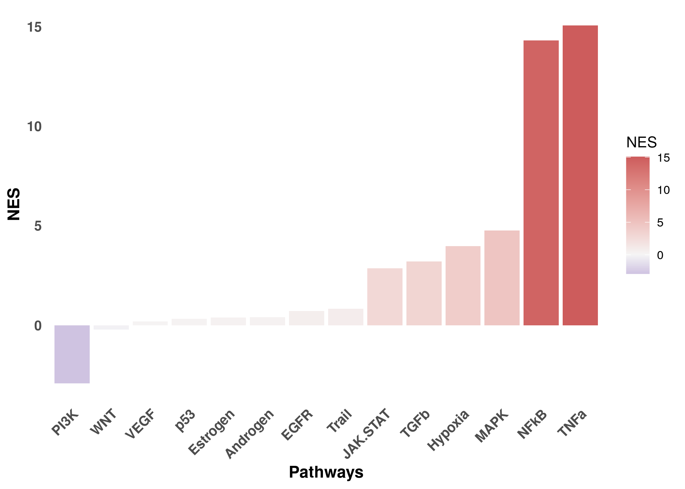
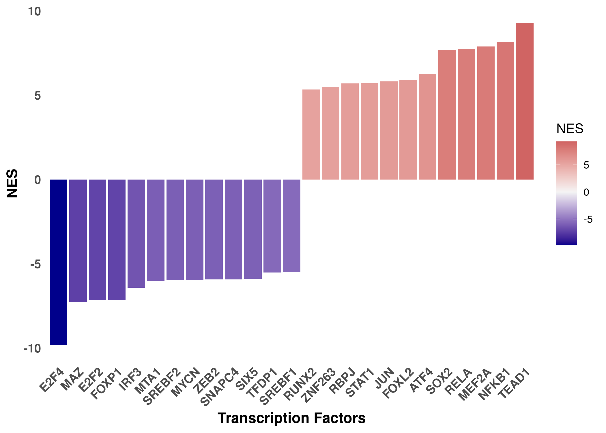
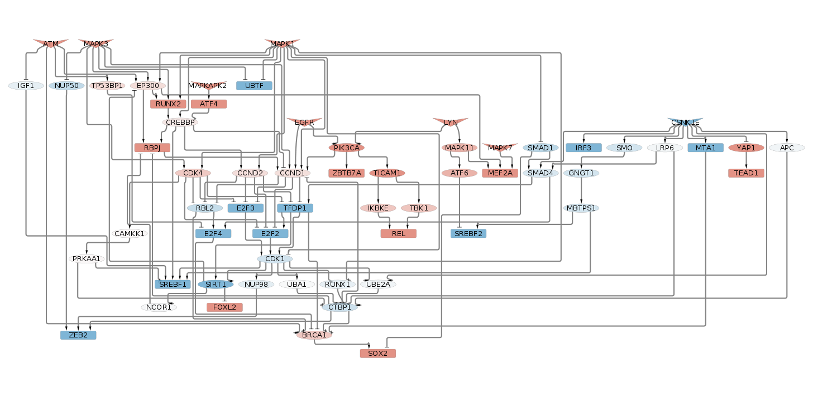
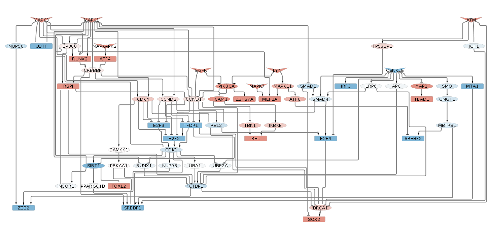

CARNIVAL for causal integration of Phospho and transcriptomics data
after SARS-CoV-2 infection
================
Alberto Valdeolivas: <alberto.valdeolivas@bioquant.uni-heidelberg.de>;
Date:
09/07/2020

### License Info

This program is free software: you can redistribute it and/or modify it
under the terms of the GNU General Public License as published by the
Free Software Foundation, either version 3 of the License, or (at your
option) any later version.

This program is distributed in the hope that it will be useful, but
WITHOUT ANY WARRANTY; without even the implied warranty of
MERCHANTABILITY or FITNESS FOR A PARTICULAR PURPOSE. See the GNU General
Public License for more details.

Please check <http://www.gnu.org/licenses/>.

## Introduction

The present script computes TF activity from transcriptomics data on the
A549 human lung derived cell line after SARS-CoV-2 infection. It also
takes kinase activity derived from phosphoproteomics data in the same
cell line. Both experiments were conducted 24 hours after SARS-CoV-2
infection, but they come from two different independent publications
(see references)

## Getting the inputs for CARNIPHAL

We first load the required libraries and define a function to export
CARNIVAL results to cytoscape.

``` r
library(readr)
library(DESeq2)
library(CARNIVAL)
library(OmnipathR)
library(progeny)
library(dorothea)
library(dplyr)
library(readr)
library(tidyr)
library(tibble)
library(ggplot2)

## We also define a function to format the CARNIVAL output to cytoscape
OutputCyto <- function(CarnivalResults, outputFile) {
    CarnivalNetwork <- 
        as.data.frame(CarnivalResults$weightedSIF, stringsAsFactors = FALSE) %>%
        dplyr::mutate(Sign = as.numeric(Sign), Weight = as.numeric(Weight)) %>% 
        dplyr::mutate(Weight = Sign * Weight) %>%
        dplyr::select(Node1, Weight, Node2)
        
    CarnivalNetworkNodes <- 
        unique(c(CarnivalNetwork$Node1,CarnivalNetwork$Node2))
    
    CarnivalAttributes <- CarnivalResults$nodesAttributes %>% 
        as.data.frame() %>%
        dplyr::filter(Node %in% CarnivalNetworkNodes) %>%
        dplyr::mutate(NodeType = as.character(NodeType)) %>%
        dplyr::mutate(NodeType=if_else(NodeType =="", "I", NodeType))
            
    nameOutputNetwork <- paste0(outputFile, "Network.sif")
    nameOutputAttributes <-  paste0(outputFile, "Attributes.txt")    
    
    write.table(CarnivalNetwork, file = nameOutputNetwork,
        quote = FALSE, row.names = FALSE, col.names = FALSE, sep = " ")
    
    write.table(CarnivalAttributes, file = nameOutputAttributes,
        quote = FALSE, row.names = FALSE, col.names = TRUE, sep = "\t")
}
```

### Differential expression analysis on the transcriptomics data

We take the series 5 from the following dataset (A549 mock treated
versus SARS-CoV-2 infected):

<https://www.ncbi.nlm.nih.gov/geo/query/acc.cgi?acc=GSE147507>

which is related to the following publication:

<https://www.cell.com/cell/pdf/S0092-8674(20)30489-X.pdf?_returnURL=https%3A%2F%2Flinkinghub.elsevier.com%2Fretrieve%2Fpii%2FS009286742030489X%3Fshowall%3Dtrue>

``` r
## Raw counts table
GSE147507_raw_counts <- 
    read.csv("TranscriptomicsData/GSE147507_RawReadCounts_Human.tsv", sep = "\t")

count_A549vsCOV2_df <- GSE147507_raw_counts[,c(22:27)]
row.names(count_A549vsCOV2_df) <- GSE147507_raw_counts$X

## Define conditions
targets_A549vsCOV2 <- 
    as.data.frame(matrix(NA,length(names(count_A549vsCOV2_df)),1))
names(targets_A549vsCOV2) <- c("condition")
row.names(targets_A549vsCOV2) <- names(count_A549vsCOV2_df)
targets_A549vsCOV2$condition <- 
    gsub("Series5_", "", row.names(targets_A549vsCOV2))
targets_A549vsCOV2$condition <- 
    factor(gsub("_[1-3]$", "", targets_A549vsCOV2$condition))
targets_A549vsCOV2
```

    ##                                 condition
    ## Series5_A549_Mock_1             A549_Mock
    ## Series5_A549_Mock_2             A549_Mock
    ## Series5_A549_Mock_3             A549_Mock
    ## Series5_A549_SARS.CoV.2_1 A549_SARS.CoV.2
    ## Series5_A549_SARS.CoV.2_2 A549_SARS.CoV.2
    ## Series5_A549_SARS.CoV.2_3 A549_SARS.CoV.2

``` r
## Create deseq2 object
dds_A549vsCOV2 <- 
    DESeqDataSetFromMatrix(countData = as.matrix(count_A549vsCOV2_df), 
    colData = targets_A549vsCOV2, design = ~ condition)

## Set control
dds_A549vsCOV2$condition <- relevel(dds_A549vsCOV2$condition, 
    ref = levels(targets_A549vsCOV2$condition)[1])

## Carry out diff exp
dds_A549vsCOV2 <- DESeq(dds_A549vsCOV2)

## See the comparisons carried out
comparison_A549vsCOV2 <- resultsNames(dds_A549vsCOV2)

## Get results table
results_A549vsCOV2 <- 
    results(dds_A549vsCOV2, name=comparison_A549vsCOV2[2])
```

### Pathway activity estimation using Progeny

We first estimate the pathway activity using the Progeny package. In
particular, we compute the normalised enriched score (NEs) of the
different pathways by running Progeny using the statistic from the
differential express analysis.

``` r
dds_A549vsCOV2_df <- as.data.frame(results_A549vsCOV2) %>% 
    rownames_to_column(var = "GeneID") %>% 
    dplyr::select(GeneID, stat) %>% 
    dplyr::filter(!is.na(stat)) %>% 
    column_to_rownames(var = "GeneID") 

pathways_A549vsCOV2_zscore <- t(progeny(as.matrix(dds_A549vsCOV2_df), 
    scale=TRUE, organism="Human", top = 100, perm = 10000, z_scores = TRUE))
colnames(pathways_A549vsCOV2_zscore) <- "NES"

## I also need to run progeny in such a way to have values between 1 and -1 to
## use as CARNIVAL input
pathways_A549vsCOV2_zscore_inputCarnival <- 
  t(progeny(as.matrix(dds_A549vsCOV2_df), 
    scale=TRUE, organism="Human", top = 100, perm = 10000, z_scores = FALSE))
colnames(pathways_A549vsCOV2_zscore_inputCarnival) <- "Activity"
```

We now display the normalized enrichment scores (NES) in a bar plot.

``` r
pathways_A549vsCOV2_zscore_df <- as.data.frame(pathways_A549vsCOV2_zscore) %>% 
    rownames_to_column(var = "Pathway") %>%
    dplyr::arrange(NES) %>%
    dplyr::mutate(Pathway = factor(Pathway))

ggplot(pathways_A549vsCOV2_zscore_df,aes(x = reorder(Pathway, NES), y = NES)) + 
    geom_bar(aes(fill = NES), stat = "identity") +
    scale_fill_gradient2(low = "darkblue", high = "indianred", 
        mid = "whitesmoke", midpoint = 0) + 
    theme_minimal() +
    theme(axis.title = element_text(face = "bold", size = 12),
        axis.text.x = 
            element_text(angle = 45, hjust = 1, size =10, face= "bold"),
        axis.text.y = element_text(size =10, face= "bold"),
        panel.grid.major = element_blank(), 
        panel.grid.minor = element_blank()) +
    xlab("Pathways")
```

<!-- -->

### Transcription Factor activity with Dorothea and Viper

Now, we estimate the transcription factor (TF) activity using the
dorothea package. We select Dorothea interactions with confidence level
A, B and C.

``` r
## We load Dorothea Regulons
data(dorothea_hs, package = "dorothea")
regulons <- dorothea_hs %>%
  dplyr::filter(confidence %in% c("A", "B","C"))
```

We run Viper using the statistic from the different expression analysis.

``` r
dds_A549vsCOV2_stat <-  as.data.frame(results_A549vsCOV2) %>% 
    rownames_to_column(var = "GeneID") %>% 
    dplyr::select(GeneID, stat) %>% 
    dplyr::filter(!is.na(stat)) %>% 
    column_to_rownames(var = "GeneID") %>%
    as.matrix()

tf_activities_A549vsCOV2_stat <- 
    dorothea::run_viper(as.matrix(dds_A549vsCOV2_stat), regulons,
    options =  list(minsize = 5, eset.filter = FALSE, 
    cores = 1, verbose = FALSE, nes = TRUE))
```

We now display the top 25 normalized enrichment scores (NES) for the TF
in a bar plot.

``` r
tf_activities_A549vsCOV2_top25 <- tf_activities_A549vsCOV2_stat %>%
    as.data.frame() %>% 
    rownames_to_column(var = "GeneID") %>%
    dplyr::rename(NES = "stat") %>%
    dplyr::top_n(25, wt = abs(NES)) %>%
    dplyr::arrange(NES) %>% 
    dplyr::mutate(GeneID = factor(GeneID))

ggplot(tf_activities_A549vsCOV2_top25,aes(x = reorder(GeneID, NES), y = NES)) + 
    geom_bar(aes(fill = NES), stat = "identity") +
    scale_fill_gradient2(low = "darkblue", high = "indianred", 
        mid = "whitesmoke", midpoint = 0) + 
    theme_minimal() +
    theme(axis.title = element_text(face = "bold", size = 12),
        axis.text.x = 
            element_text(angle = 45, hjust = 1, size =10, face= "bold"),
        axis.text.y = element_text(size =10, face= "bold"),
        panel.grid.major = element_blank(), 
        panel.grid.minor = element_blank()) +
    xlab("Transcription Factors")
```

<!-- -->

### Reading Kinase Activity

We here read the kinase activity computed by Danish Memon
<memon@ebi.ac.uk> from the phosphoproteomics data extracted from the
following publication:

<https://www.biorxiv.org/content/10.1101/2020.06.17.156455v1>

``` r
## We take the kinase activity after 24 hours to be in line with the transcriptomics
## data
DIA_kinase_activity <- read_csv("Mann/diaCovidKinaseActMat.csv") %>% 
    dplyr::rename(kinase = "X1") %>% 
    dplyr::select(kinase, `24h`)
```

    ## Warning: Missing column names filled in: 'X1' [1]

### Generating the Prior Knowledge Network from Omnipath

We use the OmnipathR package to fetch the Omnipath database and generate
the prior knowledge network. We take the signed and directed
protein-protein interactions.

``` r
ia_omnipath <- import_omnipath_interactions() %>% as_tibble()
```

    ## Downloaded 36684 interactions.

``` r
ia_pwextra <- import_pathwayextra_interactions() %>% as_tibble()
```

    ## Downloaded 44955 interactions.

``` r
ia_kinaseextra <- import_kinaseextra_interactions() %>% as_tibble()
```

    ## Downloaded 22338 interactions.

``` r
## We bind the datasets
interactions <- as_tibble(
    bind_rows(
        ia_omnipath %>% mutate(type = 'ppi'),
        ia_pwextra %>% mutate(type = 'ppi'),
        ia_kinaseextra %>% mutate(type = 'ppi')))

signed_directed_interactions <- 
    dplyr::filter(interactions, consensus_direction==1) %>%
    filter(consensus_stimulation == 1 | consensus_inhibition == 1) %>% 
    dplyr::mutate(sign = if_else(consensus_stimulation==1,1,-1))  %>%
    dplyr::select(source_genesymbol, sign,  target_genesymbol) %>%
    dplyr::rename(source ="source_genesymbol", target ="target_genesymbol")

carnival_pkn <- signed_directed_interactions %>%
    dplyr::distinct(source, target, .keep_all = TRUE)

all_source_nodes <- unique(carnival_pkn$source)
all_target_nodes <- unique(carnival_pkn$target)
all_nodes_network <- unique(c(all_source_nodes,all_target_nodes))
```

## Results

We are going to run CARNIVAL twice using the TF activity as the CARNIVAL
measurements and the kinase activities as perturbations. In the second
run, we will additionally use pathway scores from progeny as weights for
the network. For these runs, we are going to select the top 30 TFs and
the top 10 kinases.

``` r
top_10_kinases <- DIA_kinase_activity %>% 
    dplyr::filter(kinase %in% all_source_nodes) %>% 
    dplyr::top_n(10,abs(`24h`)) %>%  
    tibble::column_to_rownames(var = "kinase") %>% 
    t() %>% sign() %>% as.data.frame()

top_30_tf <- tf_activities_A549vsCOV2_stat %>% 
  as.data.frame() %>% 
  rownames_to_column(var = "GeneID") %>%
  dplyr::filter(GeneID %in% all_nodes_network) %>%
  dplyr::arrange(desc(abs(stat))) %>%
  dplyr::top_n(30, wt = abs(stat)) %>%
  column_to_rownames(var = "GeneID") %>%
  t() %>% as.data.frame()

progeny_weigths <- pathways_A549vsCOV2_zscore_inputCarnival %>% 
    as.data.frame() %>% t()
```

### CARNIVAL without progeny weights

``` r
carnival_results_noprogeny <-runCARNIVAL(
    solverPath="/opt/ibm/ILOG/CPLEX_Studio129/cplex/bin/x86-64_linux/cplex",
    netObj=carnival_pkn,
    measObj=top_30_tf,
    inputObj = top_10_kinases,
    # dir_name="Carnival_Results",
    # weightObj=as.data.frame(t(Kin_activity_LNCaP_noInhib_t1_EGF)),
    # nodeID = 'gene',
    timelimit = 900,
    solver = "cplex")
saveRDS(carnival_results_noprogeny, 
    file = "Carnival_Results/carnival_results_noprogeny.rds")
OutputCyto(carnival_results_noprogeny, 
    outputFile="Carnival_Results/carnival_results_noprogeny")
```

Network with the results: Rectangles are the most active transcription
factors after infection and the inverse triangles are the most active
kinases. Ellipses are signaling intermediates proteins linking those
kinsases and TFs. Red means positive activity or overphosphorylation
after infection and blue the opposite.

<br><br> 
<br><br>

### CARNIVAL with progeny weights

``` r
carnival_results_withprogeny <-runCARNIVAL(
    solverPath="/opt/ibm/ILOG/CPLEX_Studio129/cplex/bin/x86-64_linux/cplex",
    netObj=carnival_pkn,
    measObj=top_30_tf,
    inputObj = top_10_kinases,
    # dir_name="Carnival_Results",
    weightObj=progeny_weigths,
    # nodeID = 'gene',
    timelimit = 900,
    solver = "cplex")
saveRDS(carnival_results_withprogeny, 
    file = "Carnival_Results/carnival_results_withprogeny.rds")
OutputCyto(carnival_results_withprogeny, 
    outputFile="Carnival_Results/carnival_results_withprogeny")
```

<br><br>

<br><br>

## Session Info Details

    ## R version 4.0.1 (2020-06-06)
    ## Platform: x86_64-pc-linux-gnu (64-bit)
    ## Running under: Ubuntu 19.10
    ## 
    ## Matrix products: default
    ## BLAS:   /usr/lib/x86_64-linux-gnu/openblas/libblas.so.3
    ## LAPACK: /usr/lib/x86_64-linux-gnu/libopenblasp-r0.3.7.so
    ## 
    ## locale:
    ##  [1] LC_CTYPE=en_GB.UTF-8       LC_NUMERIC=C              
    ##  [3] LC_TIME=en_GB.UTF-8        LC_COLLATE=en_GB.UTF-8    
    ##  [5] LC_MONETARY=en_GB.UTF-8    LC_MESSAGES=en_GB.UTF-8   
    ##  [7] LC_PAPER=en_GB.UTF-8       LC_NAME=C                 
    ##  [9] LC_ADDRESS=C               LC_TELEPHONE=C            
    ## [11] LC_MEASUREMENT=en_GB.UTF-8 LC_IDENTIFICATION=C       
    ## 
    ## attached base packages:
    ## [1] parallel  stats4    stats     graphics  grDevices utils     datasets 
    ## [8] methods   base     
    ## 
    ## other attached packages:
    ##  [1] ggplot2_3.3.1               tibble_3.0.1               
    ##  [3] tidyr_1.1.0                 dplyr_1.0.0                
    ##  [5] dorothea_1.0.0              progeny_1.11.1             
    ##  [7] OmnipathR_1.3.2             jsonlite_1.6.1             
    ##  [9] igraph_1.2.5                CARNIVAL_1.0.1             
    ## [11] DESeq2_1.28.1               SummarizedExperiment_1.18.1
    ## [13] DelayedArray_0.14.0         matrixStats_0.56.0         
    ## [15] Biobase_2.48.0              GenomicRanges_1.40.0       
    ## [17] GenomeInfoDb_1.24.0         IRanges_2.22.2             
    ## [19] S4Vectors_0.26.1            BiocGenerics_0.34.0        
    ## [21] readr_1.3.1                
    ## 
    ## loaded via a namespace (and not attached):
    ##  [1] segmented_1.1-0        Category_2.54.0        bitops_1.0-6          
    ##  [4] bit64_0.9-7            doParallel_1.0.15      RColorBrewer_1.1-2    
    ##  [7] httr_1.4.1             tools_4.0.1            R6_2.4.1              
    ## [10] KernSmooth_2.23-17     DBI_1.1.0              colorspace_1.4-1      
    ## [13] withr_2.2.0            gridExtra_2.3          tidyselect_1.1.0      
    ## [16] bit_1.1-15.2           curl_4.3               compiler_4.0.1        
    ## [19] graph_1.66.0           labeling_0.3           scales_1.1.1          
    ## [22] genefilter_1.70.0      RBGL_1.64.0            rappdirs_0.3.1        
    ## [25] stringr_1.4.0          digest_0.6.25          mixtools_1.2.0        
    ## [28] rmarkdown_2.2          XVector_0.28.0         pkgconfig_2.0.3       
    ## [31] htmltools_0.4.0        bcellViper_1.24.0      dbplyr_1.4.4          
    ## [34] rlang_0.4.6            RSQLite_2.2.0          farver_2.0.3          
    ## [37] generics_0.0.2         BiocParallel_1.22.0    viper_1.22.0          
    ## [40] RCurl_1.98-1.2         magrittr_1.5           GenomeInfoDbData_1.2.3
    ## [43] Matrix_1.2-18          Rcpp_1.0.4.6           munsell_0.5.0         
    ## [46] lifecycle_0.2.0        stringi_1.4.6          yaml_2.2.1            
    ## [49] UniProt.ws_2.28.0      MASS_7.3-51.6          zlibbioc_1.34.0       
    ## [52] BiocFileCache_1.12.0   grid_4.0.1             blob_1.2.1            
    ## [55] ggrepel_0.8.2          crayon_1.3.4           lattice_0.20-41       
    ## [58] splines_4.0.1          annotate_1.66.0        hms_0.5.3             
    ## [61] locfit_1.5-9.4         knitr_1.28             pillar_1.4.4          
    ## [64] geneplotter_1.66.0     codetools_0.2-16       lpSolve_5.6.15        
    ## [67] XML_3.99-0.3           glue_1.4.1             evaluate_0.14         
    ## [70] vctrs_0.3.1            foreach_1.5.0          gtable_0.3.0          
    ## [73] purrr_0.3.4            kernlab_0.9-29         assertthat_0.2.1      
    ## [76] xfun_0.14              xtable_1.8-4           e1071_1.7-3           
    ## [79] class_7.3-17           survival_3.1-12        iterators_1.0.12      
    ## [82] AnnotationDbi_1.50.0   memoise_1.1.0          ellipsis_0.3.1        
    ## [85] GSEABase_1.50.1
